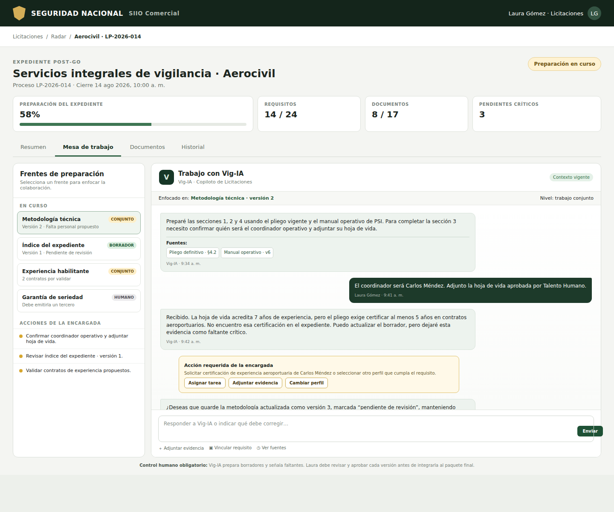

# Diseño — Mesa de trabajo de Vig‑IA para expedientes post‑GO

**Fecha:** 2026-07-28

**Estado:** Aprobado conceptualmente; pendiente de plan de implementación

**Alcance:** colaboración contextual entre la encargada de Licitaciones y Vig‑IA/AGT‑002 dentro del expediente post‑GO

## 1. Decisión

SIIO incorporará una **Mesa de trabajo** dentro de cada expediente de licitación que haya recibido decisión humana GO.

La Mesa de trabajo tendrá una conversación principal en lenguaje natural entre la encargada de Licitaciones y **Vig‑IA**, respaldada técnicamente por AGT‑002. La conversación estará ligada al expediente y permitirá preparar documentos, identificar faltantes, solicitar evidencia, crear versiones y registrar aprendizaje institucional.

La identidad visible será **Vig‑IA · Copiloto de Licitaciones**. El identificador `AGT-002`, el productor, el modelo, la versión contractual y la versión de política sólo aparecerán en auditoría técnica.

La encargada de Licitaciones será:

- tutora funcional del agente;
- fuente experta para corregir y orientar su trabajo;
- revisora obligatoria de cada versión documental;
- autoridad para aprobar o rechazar aprendizajes reutilizables;
- autoridad para ampliar o reducir la autonomía documental dentro de los límites institucionales.

Vig‑IA nunca aprobará su propio trabajo ni enviará documentos a una entidad contratante.

## 2. Estado previo y compatibilidad

### 2.1 Expediente post‑GO desplegado

Las migraciones `040`–`042` ya proporcionan:

- `psi_tender_dossier_items`;
- `psi_tender_dossier_item_actions` append‑only;
- `psi_tender_dossier_artifacts`;
- `psi_tender_dossier_artifact_versions` append‑only;
- `psi_tender_dossier_artifact_reviews` append‑only;
- checklist, responsables, evidencias y fechas;
- versiones y revisión humana;
- gate real para `lista_para_presentar`;
- workspace canónico del expediente.

La Mesa de trabajo extenderá ese dominio. No creará un segundo repositorio de documentos dentro del chat.

### 2.2 Núcleo gobernado del copiloto comercial

El PR #38 incorporó para AGT‑003:

- contratos JSON cerrados;
- contexto autorizado y acotado;
- separación entre hechos e inferencias;
- referencias a evidencia permitida;
- bridge protegido;
- validación fail‑closed;
- idempotencia, claims, cuota y concurrencia;
- runs y feedback append‑only;
- identidad, modelo, política, hashes y uso auditables;
- revisión humana obligatoria;
- prohibición de envío y escritura automática.

Lote 3 reutilizará estas convenciones. No migrará ni refactorizará el panel AGT‑003 dentro de este lote. La Mesa de trabajo se diseñará como patrón compatible para que otros agentes conversacionales puedan adoptarlo posteriormente sin compartir contexto, permisos ni políticas.

## 3. Objetivos

1. Permitir que Vig‑IA prepare por sí solo los documentos que admitan borrador autónomo.
2. Permitir trabajo conjunto en documentos que requieran decisiones, evidencia o conocimiento de la encargada.
3. Detectar con precisión qué falta, por qué falta, quién debe aportarlo y qué acción debe realizarse.
4. Mantener una conversación natural ligada al expediente completo y a elementos documentales específicos.
5. Crear versiones documentales trazables con fuentes, productor y trabajo originador.
6. Exigir revisión humana de toda versión antes de integrarla al paquete final.
7. Convertir correcciones de la encargada en propuestas de aprendizaje gobernadas.
8. Aumentar progresivamente la autonomía de Vig‑IA sin permitir auto‑promoción ni aprendizaje opaco.
9. Servir como patrón visual y de interacción para futuros agentes con campos conversacionales.

## 4. Fuera de alcance

Lote 3 no autoriza a Vig‑IA a:

- decidir GO o NO GO;
- aprobar documentos;
- fijar precios o una propuesta económica definitiva;
- firmar;
- emitir declaraciones jurídicas definitivas;
- emitir certificaciones, garantías o pólizas de terceros;
- enviar comunicaciones externas;
- radicar o presentar ofertas;
- modificar sus permisos;
- activar aprendizajes sin aprobación;
- ampliar su nivel de autonomía por sí solo;
- consultar expedientes fuera del alcance de la persona solicitante;
- realizar búsqueda pública irrestricta;
- operar con datos productivos antes del gate específico de activación.

La automatización de presentación ante la entidad contratante permanece fuera del producto. La entrega final siempre es responsabilidad de la encargada de Licitaciones.

## 5. Experiencia aprobada

### 5.1 Ubicación

La Mesa de trabajo vivirá dentro del expediente post‑GO con estas vistas:

```text
Expediente
├── Resumen
├── Mesa de trabajo
├── Documentos
└── Historial
```

### 5.2 Patrón visual



La vista contendrá:

- resumen de preparación;
- lista de frentes activos;
- nivel de autoridad por frente;
- acciones pendientes de la encargada;
- conversación principal;
- contexto documental activo;
- mensajes con fuentes;
- tarjetas de acción;
- adjuntos y vínculos a requisitos;
- estado del procesamiento;
- advertencia persistente de revisión humana.

### 5.3 Un hilo por caso

Cada expediente tendrá una conversación principal independiente.

No existirá un chat global que mezcle licitaciones. Cada mensaje podrá vincularse opcionalmente a:

- expediente general;
- requisito;
- ítem del checklist;
- documento;
- versión;
- evidencia;
- tarea;
- pregunta pendiente;
- propuesta de aprendizaje.

La conversación conserva visión integral, aunque el usuario enfoque temporalmente un documento o frente.

### 5.4 Patrón reutilizable

El shell común para futuros agentes ofrecerá:

- identidad visible del agente;
- contexto activo;
- hilo conversacional;
- adjuntos;
- fuentes;
- trabajos durables;
- acciones requeridas;
- frentes de trabajo;
- artefactos resultantes;
- revisión humana;
- historial y auditoría.

Cada agente definirá por configuración y contrato:

- datos consultables;
- roles autorizados;
- tipos de contexto;
- acciones permitidas;
- artefactos producibles;
- políticas de autoridad;
- memoria reutilizable;
- aprobadores;
- límites inmutables.

No se construirá un chat genérico con acceso transversal.

El shell no concede capacidades por sí mismo. Cada agente registra explícitamente sus capabilities, adaptador de contexto, política y gates. Ante ausencia o error de configuración, el shell falla cerrado y no muestra ni ejecuta la acción.

## 6. Autoridad documental

Cada tipo documental tendrá una política explícita y versionada.

### 6.1 Borrador autónomo

Vig‑IA puede preparar una versión completa cuando dispone de evidencia suficiente y vigente.

Ejemplos iniciales:

- índice del expediente;
- matriz de cumplimiento;
- cronograma de preparación;
- tabla de documentos y responsables;
- resúmenes técnicos respaldados;
- borradores administrativos que recopilan información existente.

El resultado siempre queda `pendiente_revision`. “Autónomo” no significa aprobado ni listo para presentar.

### 6.2 Trabajo conjunto

Vig‑IA prepara lo posible y solicita intervención precisa para completar el resto.

Ejemplos iniciales:

- metodología técnica;
- plan operativo;
- respuestas a requisitos específicos;
- experiencia habilitante;
- perfiles del equipo;
- documentos donde sea necesario seleccionar evidencia.

La solicitud al humano debe indicar:

- dato o evidencia faltante;
- requisito afectado;
- motivo;
- fuente aceptable;
- responsable sugerido;
- trabajo que puede continuar mientras se espera.

### 6.3 Exclusivamente humano

Vig‑IA puede identificar el requisito, explicar el faltante y revisar consistencia, pero no producir el contenido sustantivo.

Incluye de manera inmutable:

- propuesta económica definitiva;
- firma;
- declaraciones juramentadas o jurídicas definitivas;
- certificaciones emitidas por terceros;
- garantías y pólizas;
- aprobación final;
- envío, radicación y presentación.

Estas categorías no pueden promoverse mediante aprendizaje.

## 7. Revisión y versionado

La aprobación será por versión específica.

```text
Borrador de Vig‑IA o humano
→ pendiente_revision
→ aprobado | rechazado | cambios_solicitados
```

Reglas:

1. Toda versión nueva comienza `pendiente_revision`.
2. Sólo una persona autorizada puede registrar una revisión.
3. Modificar una versión aprobada crea otra versión; nunca altera la aprobada.
4. La nueva versión no hereda la aprobación anterior.
5. Vig‑IA no puede registrar una revisión humana.
6. Sólo versiones aprobadas pueden contar para readiness documental.
7. La inclusión en el paquete final sigue siendo una acción humana separada.

## 8. Procesamiento durable

Se adopta procesamiento asíncrono durable para todas las intervenciones de Vig‑IA.

### 8.1 Flujo

```text
Encargada envía mensaje
→ SIIO persiste el mensaje
→ SIIO crea un trabajo idempotente
→ worker reclama el trabajo
→ Vig‑IA recibe contexto autorizado y snapshot vigente
→ valida contrato y política
→ responde, pregunta, propone tarea o crea borrador
→ SIIO persiste resultado y vínculos
→ si hay borrador, crea nueva versión pendiente de revisión
→ conversación publica el resultado
```

Cerrar la pestaña no interrumpe el trabajo.

### 8.2 Estados visibles

Los trabajos tendrán estados funcionales equivalentes a:

- `received` — recibido;
- `queued` — en cola;
- `reviewing_evidence` — revisando fuentes;
- `preparing_response` — preparando respuesta;
- `preparing_draft` — preparando borrador;
- `waiting_human` — esperando información de la encargada;
- `completed` — completado;
- `failed` — fallido;
- `cancelled` — cancelado;
- `stale` — resultado obsoleto por cambio de snapshot o versión.

Los estados de dominio se persistirán como eventos append‑only; no se dependerá únicamente de un campo mutable para reconstruir la historia.

### 8.3 Idempotencia y orden

La clave de idempotencia incluirá como mínimo:

- hilo;
- mensaje humano originador;
- snapshot documental;
- capability;
- versión contractual;
- versión de política.

`contract_version` y `policy_version` se congelan al persistir el mensaje humano y crear el trabajo. Un reintento del mismo mensaje conserva esas versiones aunque después se publique una política nueva; aplicar la política nueva requiere una solicitud humana nueva o una acción explícita y auditada.

Cada trabajo que pueda producir una versión congela también el `base_version_id` esperado. El append agente-específico usa concurrencia optimista: si la última versión del artefacto cambió desde el inicio del trabajo, el resultado se registra `stale` y no se inserta como una nueva versión. Así la proyección vigente por versión máxima nunca muestra un resultado obsoleto.

Un reintento no puede duplicar:

- mensaje del agente;
- trabajo;
- tarea;
- versión documental;
- propuesta de aprendizaje.

Un resultado generado sobre un snapshot anterior no puede desplazar un resultado más reciente.

## 9. Modelo de dominio

El plan de implementación definirá SQL exacto, pero el dominio deberá separar estas responsabilidades.

### 9.1 Hilos

Identidad estable de la conversación por expediente:

- `thread_id`;
- `opportunity_id`;
- `tender_id`;
- estado abierto, cerrado o archivado;
- fecha de creación;
- actor creador.

Existirá como máximo un hilo principal activo por oportunidad.

### 9.2 Mensajes

Registro append‑only:

- `message_id`;
- `thread_id`;
- autor humano, agente o sistema;
- contenido;
- tipo;
- mensaje precedente cuando sea respuesta;
- fecha;
- productor técnico cuando corresponda;
- estado de visibilidad;
- hash del contenido.

### 9.3 Vínculos de contexto

Relación append‑only entre mensajes y recursos:

- requisito;
- ítem;
- documento;
- versión;
- evidencia;
- tarea;
- snapshot;
- propuesta de aprendizaje.

El servidor valida que cada recurso pertenezca a la misma oportunidad.

### 9.4 Trabajos y eventos

El trabajo durable tendrá identidad estable y una secuencia append‑only de eventos. El dominio reutiliza el patrón de claims, cuotas e idempotencia probado en AGT‑003, pero tendrá tablas propias para los trabajos conversacionales de AGT‑002.

No reutiliza `psi_agt003_copilot_runs`, `psi_agt003_copilot_claims` ni `psi_agt003_copilot_feedback`, porque sus constraints fijan la capability `agt003.opportunity-copilot.preview`. Tampoco mezcla los trabajos conversacionales con `psi_tender_processing_jobs`, cuya responsabilidad actual es el pipeline documental descubrir/importar/crear snapshot/analizar.

### 9.5 Versiones producidas por Vig‑IA

Las versiones producidas por Vig‑IA no usan el RPC humano `psi_add_tender_dossier_artifact_version`, que exige identidad humana. Lote 3 define un RPC agente-específico cerrado que:

- sólo puede invocar el worker autorizado, nunca el navegador;
- valida la identidad técnica AGT‑002 y la pertenencia del trabajo, hilo, artefacto y oportunidad;
- recibe el `base_version_id` esperado y rechaza el append si cambió;
- asigna `author_id` al perfil técnico AGT‑002 con `identity_type = 'agent'`;
- registra `author_kind = 'agent'`, trabajo originador, modelo, capability, contrato y política;
- crea exclusivamente una versión `pendiente_revision`;
- nunca crea una revisión ni una aprobación.

La tabla `psi_tender_dossier_artifact_versions` se extiende aditivamente con `author_kind` —`human` por defecto o `agent`— y `origin_agent_job_id`, FK nullable al trabajo durable. Para una versión agente, `origin_agent_job_id` es obligatorio y `author_id` debe corresponder a un perfil activo con `identity_type = 'agent'`; para una versión humana, el job queda nulo. Modelo, capability, contrato y política se consultan de forma trazable a través del trabajo enlazado, sin depender de logs externos ni duplicar esos campos en la versión.

La revisión continúa exclusivamente por el RPC humano `psi_record_tender_dossier_artifact_review`, sujeto al permiso de custodia definido en §12.

### 9.6 Acciones requeridas

Vig‑IA podrá proponer acciones acotadas:

- aportar información;
- adjuntar evidencia;
- confirmar dato;
- seleccionar alternativa;
- asignar responsable;
- revisar versión;
- solicitar corrección;
- resolver contradicción.

Crear una tarjeta no ejecuta automáticamente la acción.

### 9.7 Propuestas de aprendizaje

Una propuesta separada del hilo activo conservará:

- licitación de origen;
- mensajes y correcciones de origen;
- patrón propuesto;
- alcance;
- tipos documentales;
- nivel de autoridad sugerido;
- vigencia;
- riesgos;
- autor técnico;
- estado de revisión;
- decisión y comentario de la encargada;
- versión de política resultante.

## 10. Aprendizaje institucional gobernado

### 10.1 Tutora funcional

La encargada de Licitaciones podrá:

- corregir borradores;
- explicar el motivo de una corrección;
- aprobar o rechazar patrones;
- limitar alcance;
- definir vigencia;
- retirar conocimiento obsoleto;
- promover o degradar autonomía documental dentro de las categorías permitidas.

### 10.2 Alcances

Cada aprendizaje aprobado tendrá uno de estos alcances:

1. sólo esta licitación;
2. entidad contratante;
3. modalidad o sector;
4. regla institucional general de PSI.

La aplicación debe elegir el alcance más específico compatible con el expediente actual. Una regla particular de una entidad no puede generalizarse automáticamente.

### 10.3 Ciclo

```text
Corrección o resultado de licitación
→ Vig‑IA propone patrón
→ encargada revisa
→ aprueba, ajusta o rechaza
→ SIIO publica nueva versión de política
→ futuras solicitudes registran la versión utilizada
```

No habrá fine‑tuning continuo, modificación autónoma del modelo ni actualización opaca del prompt desde conversaciones productivas. El aprendizaje operativo será memoria estructurada, versionada y aprobada.

## 11. Contrato de AGT‑002

La capability conversacional será nueva y no modificará contratos `v1` existentes.

El contrato debe ser cerrado y acotado, siguiendo el patrón AGT‑003.

### 11.1 Solicitud

Debe incluir:

- identidad contractual;
- capability;
- correlación;
- hilo y mensaje originador;
- oportunidad y tender;
- snapshot documental vigente;
- contexto enfocado;
- mensajes recientes acotados;
- resumen histórico seguro cuando sea necesario;
- requisitos e ítems autorizados;
- versiones y revisiones relevantes;
- evidencia autorizada;
- aprendizajes aprobados aplicables;
- política de autoridad documental;
- límites explícitos.

Todo texto proveniente de documentos, CRM o mensajes se marca como contenido no confiable.

### 11.2 Respuesta

Debe separar:

- mensaje visible;
- hechos y fuentes;
- inferencias y confianza;
- información faltante;
- preguntas a la encargada;
- acciones propuestas;
- borradores propuestos;
- vínculos de contexto;
- propuestas de aprendizaje;
- advertencias;
- revisión humana requerida;
- identidad, modelo, política y uso.

Una respuesta que cite evidencia no incluida en la solicitud será inválida.

### 11.3 Productor visible y técnico

Interfaz principal:

```text
Vig‑IA · Copiloto de Licitaciones
```

Auditoría:

```text
agent_id = AGT-002
producer = agent_ai
capability_id = <capability contractual>
contract_version = <versión>
policy_version = <versión>
model = <modelo canónico>
```

No se presentará a Hermes, reglas determinísticas ni otro productor como AGT‑002.

## 12. Autorización

El servidor resolverá autorización antes de construir contexto o invocar al agente.

Las capacidades se separarán al menos en:

- ver Mesa de trabajo;
- enviar mensajes;
- adjuntar evidencia;
- crear o editar borradores;
- revisar versiones;
- aprobar versiones;
- revisar propuestas de aprendizaje;
- publicar políticas aprobadas;
- ver auditoría técnica.

El agente hereda el alcance efectivo de la persona solicitante y nunca lo amplía.

La autoridad documental de la encargada se mapea a **Custodia de Licitaciones** (`licitaciones_custodia`), no a la autoridad GO/NO‑GO:

- ver la Mesa, enviar mensajes, adjuntar evidencia y preparar o editar borradores: acceso operativo (`LICITACIONES_VIEW` / permiso `licitaciones`);
- revisar y aprobar versiones, revisar aprendizajes y publicar políticas aprobadas: permiso `licitaciones_custodia`, asignado expresamente a la encargada;
- decidir GO/NO‑GO: continúa bajo `LICITACIONES_GO_NO_GO_APPROVE` y no se concede por custodiar documentos.

El RPC desplegado `psi_record_tender_dossier_artifact_review` exige actualmente rol manager. Antes de habilitar Lote 3, una migración aditiva hará que ese RPC reconozca `licitaciones_custodia` —o un permiso dedicado equivalente— sin degradarlo a simple acceso `licitaciones`. No se introduce una ruta de aprobación más débil ni se obliga a otorgar a la encargada autoridad GO/NO‑GO para cumplir su responsabilidad documental.

Los RPC con escritura usarán actor de sesión validado y no confiarán en un `actor_id` arbitrario del cuerpo HTTP.

Tablas de conversación, jobs, eventos y aprendizaje tendrán RLS activa, sin políticas de acceso directo para `anon` ni `authenticated`. La escritura ocurrirá mediante RPC cerrados y autorizados.

## 13. Fallos y abstención

### 13.1 Evidencia insuficiente

Vig‑IA debe abstenerse de completar la sección afectada y explicar:

- qué falta;
- por qué;
- requisito afectado;
- fuente válida;
- responsable sugerido;
- trabajo no bloqueado.

### 13.2 Evidencia contradictoria

Debe mostrar las fuentes en conflicto, detener el contenido afectado y solicitar resolución humana. No selecciona silenciosamente una fuente.

### 13.3 Obsolescencia

Antes de persistir una respuesta o versión se revalida:

- snapshot vigente;
- pliego y adendas conocidas;
- última versión del artefacto;
- política activa;
- hilo y oportunidad.

Si cambió el contexto, el resultado se registra `stale` y no se proyecta como vigente.

Para versiones documentales, esta garantía se aplica antes del insert mediante `base_version_id`: si la versión máxima ya no coincide con la base congelada, el RPC agente-específico no crea la versión y registra el trabajo como `stale`.

### 13.4 Indisponibilidad

La interfaz distinguirá:

- no configurado;
- saturado;
- cuota agotada;
- timeout;
- transporte fallido;
- respuesta contractual inválida;
- persistencia fallida;
- resultado obsoleto.

No habrá fallback silencioso. El mensaje humano permanece y puede reintentarse.

### 13.5 Prompt injection

Documentos, adjuntos, CRM y mensajes son datos no confiables. No pueden:

- cambiar políticas;
- ampliar permisos;
- ordenar envíos;
- autorizar firmas;
- revelar otro expediente;
- desactivar revisión;
- activar aprendizaje.

## 14. Auditoría

Cada trabajo conservará:

- hilo, mensaje y actor originadores;
- oportunidad y snapshot;
- capability y contrato;
- productor y modelo;
- política y aprendizajes aplicados;
- hashes de entrada y salida;
- fuentes autorizadas;
- tokens, costo y duración;
- claim, reintentos y estado;
- mensajes y acciones producidos;
- documento y versión creados;
- revisión humana;
- fallos y abstenciones.

La conversación mostrará fuentes y estado funcional. Los detalles técnicos completos estarán en una vista secundaria con permiso específico.

## 15. Estrategia de entrega

### Corte A — Dominio y shell desactivado

- contratos y policy fixtures;
- hilos, mensajes, vínculos, jobs, eventos y aprendizaje;
- API fail‑closed;
- shell Mesa de trabajo con feature flag apagado;
- sin invocación real de AGT‑002.

### Corte B — Worker y responder sintético

- worker durable;
- validación de contratos;
- estados y reintentos;
- responder sintético sólo en pruebas;
- generación de versiones sobre fixtures.

### Corte C — Gate de activación

Requiere aprobación humana separada para:

- bridge y credenciales;
- cuota y concurrencia;
- modelo canónico;
- política inicial;
- prueba sintética controlada;
- observabilidad y kill switch.

### Corte D — Prueba limitada autorizada

Después de aprobar el smoke sintético:

- un expediente autorizado;
- una capability acotada;
- un único trabajo a la vez;
- sin envío ni datos fuera del expediente;
- revisión de todas las salidas;
- rollback por feature flag.

## 16. Estrategia de pruebas

### 16.1 Contratos

- solicitud válida;
- claves inesperadas rechazadas;
- identidad o snapshot incorrectos rechazados;
- evidencia no autorizada rechazada;
- salida sin revisión humana rechazada;
- acciones prohibidas rechazadas;
- categorías exclusivamente humanas protegidas.

### 16.2 Base de datos

- un hilo activo por oportunidad;
- mensajes append‑only;
- vínculos limitados a la misma oportunidad;
- eventos append‑only;
- idempotencia bajo concurrencia;
- RLS y grants fail‑closed;
- una versión nueva no hereda aprobación;
- aprendizaje no aprobado no se proyecta como activo.
- RPC agente-específico rechaza identidad humana o invocación directa no autorizada;
- resultado con `base_version_id` obsoleto no inserta una versión;
- custodia puede revisar documentos sin adquirir autoridad GO/NO‑GO;
- acceso operativo sin custodia no puede aprobar versiones ni aprendizajes.

### 16.3 Worker

- claim y lease;
- cierre de navegador sin pérdida;
- reintento sin duplicados;
- timeout y saturación;
- resultado tardío marcado obsoleto;
- persistencia atómica de respuesta y versión;
- fallo parcial sin afirmar completado.

### 16.4 API

- autenticación y rol;
- alcance de oportunidad;
- actor de sesión;
- paridad Express/Vercel;
- errores funcionales estables;
- payloads acotados;
- ningún secreto en respuesta o logs.

### 16.5 UI

- pestaña sólo post‑GO;
- hilo correcto al cambiar oportunidad;
- estados visibles;
- foco documental;
- fuentes y acciones accesibles;
- adjuntos;
- revisión por versión;
- aviso humano persistente;
- identidad visible Vig‑IA;
- `AGT-002` sólo en auditoría;
- responsive sin solapamientos.

### 16.6 Seguridad

- prompt injection documental;
- referencias cruzadas entre expedientes;
- actor forjado;
- aprendizaje auto‑aprobado;
- escalamiento de autonomía;
- intento de envío, firma o presentación;
- fallback mal atribuido;
- exposición de datos técnicos a rol sin permiso.

## 17. Criterios de aceptación

1. Cada expediente post‑GO puede tener una Mesa de trabajo única y durable.
2. La encargada conversa en lenguaje natural y puede adjuntar evidencia.
3. Los mensajes se vinculan a elementos del expediente sin salir de su alcance.
4. Vig‑IA identifica faltantes con acción y fuente requerida.
5. Los tres niveles de autoridad se muestran y aplican técnicamente.
6. Un borrador crea una versión pendiente de revisión, nunca una aprobación.
7. Toda modificación posterior invalida la aprobación previa para la nueva versión.
8. Cerrar el navegador no cancela el trabajo.
9. Reintentar no duplica mensajes, acciones ni versiones.
10. Cada respuesta sustantiva conserva fuentes y auditoría.
11. La encargada puede corregir y aprobar aprendizajes con alcance y vigencia.
12. Vig‑IA no aprende ni amplía autonomía por sí solo.
13. Ninguna ruta permite aprobar, firmar, enviar, radicar o presentar.
14. La UI muestra Vig‑IA y reserva `AGT-002` para auditoría.
15. El shell queda documentado como patrón reutilizable para futuros agentes conversacionales.
16. Suite focal, suite completa, build, paridad y QA visual quedan verdes.
17. La activación real permanece bloqueada hasta un gate humano posterior.

## 18. Decisiones aprobadas

- Mesa de trabajo dentro del expediente, no chat global.
- Un hilo principal por licitación.
- Opción visual B aprobada.
- Procesamiento durable asíncrono.
- Tres niveles de autoridad documental.
- Revisión humana obligatoria por versión.
- Encargada de Licitaciones como tutora funcional.
- Aprendizaje institucional aprobado y versionado.
- Alcance de aprendizaje por licitación, entidad, modalidad/sector o PSI.
- Prohibiciones institucionales inmutables.
- Patrón reutilizable para futuros agentes conversacionales.
- AGT‑002 no se activa durante la fase de diseño.
