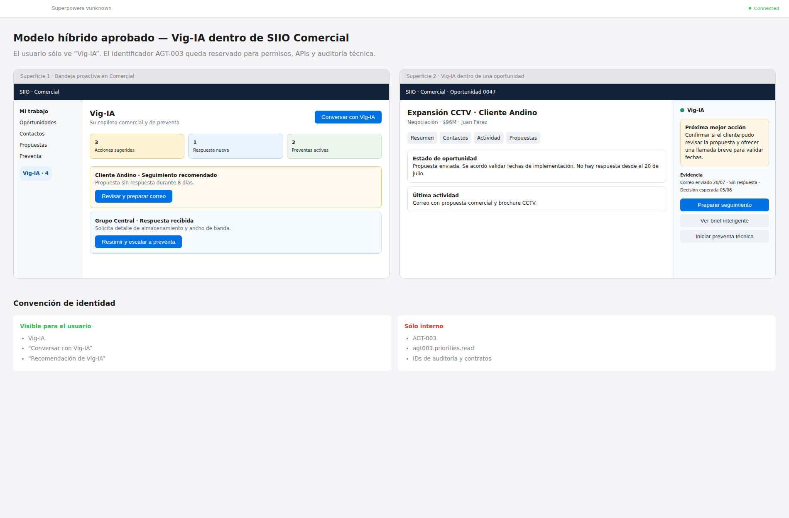

# Vig-IA — Copiloto Comercial y de Preventa PSI

**Identificador interno:** `AGT-003`

**Nombre visible:** Vig-IA

**Estado del documento:** diseño funcional aprobado

**Fecha:** 2026-07-28

**Producto anfitrión:** SIIO/CRM, sección Comercial

**Fuente complementaria:** `PRD_Plataforma_IA_Preventa_Seguridad_Electronica_v1.docx`

## 1. Resumen ejecutivo

Vig-IA será el copiloto comercial y de preventa de PSI dentro de la sección Comercial de SIIO/CRM. No será una aplicación independiente ni un chatbot genérico.

Su función es acompañar el ciclo completo de una oportunidad:

```text
comprender
→ detectar el momento comercial
→ recomendar una intervención
→ crear mensaje o material
→ obtener aprobación humana
→ ejecutar el envío
→ observar la respuesta
→ proponer el siguiente paso
→ activar preventa técnica cuando corresponda
```

La priorización por urgencia permanece como una capacidad determinística del CRM. El valor diferencial de la IA estará en comprender contexto, proponer la próxima mejor acción, redactar comunicaciones personalizadas, recomendar contenido, acompañar el seguimiento y asistir la ingeniería de preventa.

## 2. Identidad y convención de nombres

### 2.1 Nombre visible

En menús, botones, conversaciones, recomendaciones, notificaciones y correos, el usuario verá exclusivamente:

```text
Vig-IA
```

Ejemplos:

- Conversar con Vig-IA.
- Recomendación de Vig-IA.
- Preparar seguimiento con Vig-IA.
- Iniciar preventa con Vig-IA.

### 2.2 Identificador interno

`AGT-003` queda reservado para:

- contratos;
- APIs;
- capabilities;
- permisos;
- logs;
- auditoría;
- documentación técnica.

No debe exponerse en la experiencia ordinaria de usuario.

La identidad visible Vig-IA aplica a las superficies internas de SIIO. Los correos externos se envían en nombre del comercial, desde su buzón y con la firma corporativa autorizada; no incorporan la marca Vig-IA salvo que PSI apruebe explícitamente una comunicación identificada como asistida por IA.

## 3. Arquitectura funcional

```text
AGT-003 — Copiloto Comercial y de Preventa PSI
│
├── Inteligencia de oportunidades
├── Comunicaciones y seguimiento
├── Contenido comercial y propuestas
└── Ingeniería de preventa
```

Vig-IA es una identidad visible única. Las cuatro familias son módulos internos independientes, con permisos, reglas, datos, aprobaciones y despliegue progresivo.

## 4. Objetivos

### 4.1 Objetivo comercial

Ayudar al equipo a convertir contexto disperso en acciones comerciales oportunas, personalizadas, trazables y listas para aprobación.

### 4.2 Objetivo de productividad

Reducir el trabajo dedicado a:

- reconstruir el historial de una oportunidad;
- decidir cómo intervenir;
- redactar desde cero;
- buscar material;
- recordar seguimientos;
- preparar información de preventa;
- documentar la actividad.

### 4.3 Objetivo de preventa

Asistir el levantamiento técnico, aplicar reglas de ingeniería reproducibles, calcular soluciones preliminares y generar documentos sujetos a revisión profesional.

## 5. Principios

1. SIIO sigue siendo la fuente de verdad comercial.
2. Microsoft 365 sigue siendo la fuente de verdad de comunicaciones.
3. SharePoint o la biblioteca corporativa conserva los activos aprobados.
4. Plataforma Agentes provee identidad, políticas, orquestación y auditoría.
5. Vig-IA recomienda y prepara; una persona conserva la autoridad.
6. Cada envío requiere aprobación individual.
7. La IA no inventa datos, compromisos, cálculos ni referencias.
8. Hechos, inferencias y recomendaciones deben estar separados.
9. Cada afirmación material debe tener fuente, fecha y confianza.
10. Los cálculos técnicos deben ser determinísticos y reproducibles.
11. La ausencia de contexto suficiente produce abstención, no improvisación.
12. Cada capability debe fallar cerradamente.

## 6. Experiencia en SIIO

Se adopta el modelo híbrido.

Las superficies se habilitan progresivamente. En Fase 1, la bandeja y el panel muestran brief, estrategia, borradores y activos aprobados. Salud multidimensional y eventos se habilitan en Fase 3; iniciar preventa técnica aparece en Fase 5. Una función futura no debe mostrarse como operativa antes de su fase.

### 6.1 Superficie proactiva

Dentro de Comercial existirá una bandeja de Vig-IA con:

- acciones sugeridas;
- respuestas nuevas;
- seguimientos pendientes;
- preventas activas;
- borradores por revisar;
- materiales por aprobar;
- acceso a conversación general.

### 6.2 Superficie contextual

Dentro de cada oportunidad existirá un panel de Vig-IA con:

- brief inteligente;
- salud multidimensional;
- próxima mejor acción;
- evidencia;
- preparar seguimiento;
- responder correo;
- recomendar contenido;
- iniciar preventa técnica.



## 7. Inteligencia de oportunidades

### 7.1 Alcance

El score de urgencia continúa siendo determinístico y propiedad de SIIO. Vig-IA sólo lo consume mediante capabilities de lectura, interpreta el contexto y explica qué intervención tiene sentido. No calcula ni mantiene un score paralelo.

### 7.2 Brief inteligente

Debe incluir:

- necesidad del cliente;
- servicios o tecnologías considerados;
- etapa formal;
- estado real inferido;
- decisión pendiente;
- próximo hito;
- compromisos de PSI;
- compromisos del cliente;
- información faltante;
- objeciones;
- bloqueos;
- materiales enviados;
- respuesta pendiente;
- mejor acción siguiente;
- frescura de los datos.

### 7.3 Línea de tiempo

Debe sintetizar:

- contacto inicial;
- reuniones;
- información recibida;
- materiales enviados;
- propuesta enviada;
- objeciones;
- cambios de alcance;
- última interacción significativa;
- próximo compromiso.

### 7.4 Participantes

Debe distinguir:

- contacto principal;
- decisor conocido;
- influenciadores;
- usuario técnico;
- compras;
- jurídico;
- personas de PSI;
- roles aún no identificados.

Los roles inferidos deben mostrarse como inferencias.

### 7.5 Salud multidimensional

| Dimensión | Pregunta |
|---|---|
| Urgencia | ¿Qué fechas, vencimientos o compromisos requieren atención? |
| Movimiento | ¿La oportunidad está avanzando? |
| Engagement | ¿El cliente responde y participa? |
| Completitud | ¿Existe información suficiente? |
| Claridad de decisión | ¿Se conoce decisor, criterio y próximo paso? |
| Riesgo | ¿Hay silencios, bloqueos, contradicciones u objeciones? |
| Valor estratégico | ¿Cuál es su relevancia económica y estratégica? |
| Preparación de preventa | ¿Existe información suficiente para recomendar iniciar preventa? |

Cada dimensión mostrará estado, explicación, evidencia, fecha, confianza e información faltante.

Antes de Fase 5, la dimensión Preparación de preventa sólo identifica suficiencia de datos y recomienda intervención humana; no ejecuta cálculos ni crea un expediente técnico.

V1 no publicará una probabilidad de cierre generada por IA. Una probabilidad numérica sólo podrá incorporarse después de calibración histórica y aprobación metodológica.

### 7.6 Próxima mejor acción

Formato:

```text
situación detectada
→ objetivo comercial
→ acción recomendada
→ canal
→ destinatario
→ momento
→ contenido sugerido
→ material útil
→ resultado esperado
```

## 8. Comunicaciones y seguimiento

Esta será la primera familia de IA de alto valor.

### 8.1 Activación

#### Manual

- Redactar seguimiento.
- Responder este correo.
- Solicitar información.
- Manejar una objeción.
- Reactivar oportunidad.
- Enviar material.

#### Proactiva

- gestión vencida;
- ausencia de contacto;
- fecha de decisión cercana;
- propuesta sin respuesta;
- información pendiente;
- oportunidad de alto valor con baja actividad;
- compromiso de PSI pendiente.

#### Por evento

- correo recibido;
- reunión terminada;
- propuesta enviada;
- fecha cumplida;
- cambio relevante en la oportunidad.

### 8.2 Contexto permitido

```text
SIIO
+ correos relacionados por contactos o dominios vinculados
+ actividades y reuniones
+ materiales enviados
+ biblioteca aprobada
+ investigación pública con fuentes
+ voz corporativa
+ adaptación controlada al estilo del comercial
```

No habrá búsqueda irrestricta del buzón.

La asociación de comunicaciones seguirá este orden:

1. identificador de hilo ya vinculado;
2. dirección exacta de un contacto vinculado;
3. relación explícita registrada por un usuario autorizado;
4. dominio corporativo exclusivo, sólo como señal auxiliar.

Dominios genéricos o compartidos, como servicios de correo público, integradores, distribuidores o grupos empresariales, no sirven por sí solos para asociar mensajes. El cruce entre oportunidades del mismo cliente requiere una relación explícita y el scope del usuario. Ante cualquier ambigüedad, el mensaje se excluye hasta confirmación humana.

### 8.3 Estrategia antes del texto

Vig-IA propondrá:

- objetivo;
- destinatario;
- copias sugeridas;
- situación;
- mensaje central;
- CTA;
- material;
- tono;
- riesgos;
- datos por confirmar.

### 8.4 Borrador

Debe mostrar:

- asunto;
- destinatarios;
- cuerpo;
- adjuntos o materiales;
- fuentes utilizadas;
- campos por confirmar;
- explicación del enfoque.

El comercial puede editar, acortar, cambiar formalidad o CTA, regenerar, descartar o aprobar.

### 8.5 Aprobación individual

Cada autorización queda ligada a:

```text
usuario
+ oportunidad
+ destinatarios
+ asunto
+ cuerpo exacto
+ adjuntos exactos
+ ventana temporal limitada
```

Cualquier cambio invalida la aprobación y exige una nueva.

La aprobación expira según una política configurable; la política inicial será de 30 minutos. Si un reintento ocurre después de la expiración, exige una nueva aprobación. El hash de aprobación cubre destinatarios, asunto, cuerpo redactado y adjuntos. Firmas y disclaimers corporativos administrados por Microsoft 365 se consideran transformaciones controladas únicamente cuando su versión está registrada en auditoría; cualquier otra modificación invalida la aprobación.

El scope se hereda de SIIO. Puede aprobar el propietario autorizado del buzón o un delegado con permiso explícito sobre la oportunidad y la capacidad de envío. Vig-IA no amplía permisos ni convierte acceso de lectura en autoridad de envío.

### 8.6 Envío

Microsoft 365 envía desde el buzón del comercial. SIIO registra:

- aprobador;
- versión enviada;
- destinatarios;
- fecha;
- oportunidad;
- identificador del hilo;
- materiales.

### 8.7 Seguimiento

Vig-IA puede detectar:

- respuesta positiva;
- información solicitada;
- objeción;
- aplazamiento;
- rechazo;
- silencio;
- compromiso o fecha;
- nuevo participante.

Después propone resumen, siguiente acción, borrador, fecha y escalamiento. No envía automáticamente.

### 8.8 Voz

La redacción combinará:

1. voz corporativa, claims permitidos, confidencialidad y políticas;
2. adaptación controlada al estilo de cada comercial.

El estilo personal nunca puede contradecir políticas corporativas.

## 9. Contenido comercial y propuestas

### 9.1 Nivel 1 — Recomendación de activos aprobados

Alcance inicial:

- brochures;
- casos de éxito;
- fichas;
- presentaciones;
- certificaciones;
- videos;
- contenido por industria, tecnología o marca.

Cada activo debe tener audiencia, industria, servicio, marca, etapa, idioma, vigencia, confidencialidad, territorio, owner, versión y estado de aprobación.

Fase 1 incluye un manifiesto mínimo, curado y de sólo lectura de activos ya aprobados, con enlace, versión, vigencia, clasificación y autorización de uso. Fase 4 incorpora flujos completos de alta, revisión, retiro, gobierno y personalización; no posterga la verificación mínima necesaria para recomendar un activo en Fase 1.

### 9.2 Nivel 2 — One-pager personalizado

Vig-IA podrá combinar bloques aprobados para producir un borrador con contexto, reto, enfoque, servicios, beneficios, caso compatible y próximo paso.

### 9.3 Nivel 3 — Propuesta preliminar

Podrá ensamblar portada, resumen, entendimiento, solución, alcance, exclusiones, metodología, cronograma preliminar, experiencia, equipo, condiciones y anexos.

No decide precio final, descuento, margen, plazo contractual, SLA, compromiso jurídico ni excepción técnica.

### 9.4 Nivel 4 — Paquete de decisión

Para oportunidades importantes: oportunidad, estrategia, competencia conocida, riesgos, propuesta, BOM, margen, aprobaciones y preguntas de comité.

### 9.5 Gobierno de activos

```text
borrador
→ revisión
→ aprobado interno
→ aprobado externo
→ retirado
```

## 10. Ingeniería de preventa

### 10.1 Activación

Una persona autorizada selecciona `Iniciar preventa técnica`. Vig-IA crea un expediente vinculado a la oportunidad. No se activa automáticamente por una prioridad.

### 10.2 Entrevista adaptativa

Debe:

- preguntar sólo lo necesario;
- reutilizar datos existentes;
- guardar y reanudar;
- detectar faltantes;
- detectar contradicciones;
- explicar por qué necesita un dato;
- distinguir hecho, supuesto y dato pendiente.

### 10.3 Módulos

```text
Orquestador de Preventa
│
├── CCTV
├── Control de acceso
├── Intrusión
└── Detección de incendio
```

### 10.4 División IA/determinismo

El LLM conduce la entrevista, interpreta, consulta, explica y redacta. Motores determinísticos ejecutan reglas y cálculos.

### 10.5 Reglas

Cada regla registra identificador, disciplina, marca, jurisdicción, fuente, condición, resultado, unidad, fórmula, versión, vigencia, autor, revisor, estado y pruebas.

### 10.6 Conocimiento

- catálogos Dahua e Hikvision;
- marcas adicionales autorizadas;
- manuales;
- fichas;
- normas;
- plantillas;
- proyectos históricos aprobados.

Toda recomendación técnica relevante mostrará fuente y versión.

### 10.7 Cálculos preliminares

- cámaras;
- almacenamiento;
- ancho de banda;
- NVR;
- PoE;
- lectores;
- controladoras;
- paneles;
- detectores;
- sirenas;
- fuentes;
- baterías;
- cableado;
- canalizaciones;
- licencias;
- accesorios.

### 10.8 Entregables

- memoria técnica;
- BOM;
- cantidades de obra;
- especificaciones;
- alcance;
- exclusiones;
- resumen ejecutivo;
- cotización preliminar con precios autorizados.

### 10.9 Estados

```text
levantamiento
→ información incompleta
→ cálculo preliminar
→ revisión técnica
→ corrección
→ aprobado técnicamente
→ revisión comercial
→ aprobado para enviar
```

### 10.10 Roles

- Comercial: contexto y relación.
- Consultor técnico: levantamiento.
- Vig-IA: entrevista, validación, cálculo preliminar y documentos.
- Ingeniero de Preventa: aprobación técnica.
- Dirección Comercial: aprobación comercial.
- Administrador técnico: reglas y catálogos.

Incendio y compromisos normativos exigen revisión competente.

### 10.11 Fotografías y planos

V1 permite adjuntar y describir evidencia, pero no interpretar automáticamente medidas, cantidades ni riesgos visuales.

## 11. Fuentes y responsabilidades

| Componente | Responsabilidad |
|---|---|
| SIIO/CRM | Datos, permisos, estados, actividades, propuestas y fuente comercial |
| Microsoft 365 | Buzones, hilos, adjuntos, calendario y envío |
| SharePoint | Repositorio primario de activos aprobados y conocimiento documental |
| Plataforma Agentes | Identidad, policies, orquestación, modelos y auditoría |
| Vig-IA | Contexto, interpretación, recomendación, redacción y seguimiento |

La Plataforma Agentes no duplicará scoring, permisos ni reglas comerciales de SIIO.

## 12. Flujo de datos

```text
señal SIIO/M365
→ asociación con oportunidad
→ autorización de usuario y scope
→ paquete mínimo de contexto
→ análisis y recomendación
→ borrador
→ revisión
→ aprobación exacta
→ envío M365
→ registro SIIO
→ seguimiento del hilo
→ nueva recomendación
```

Cada dato del paquete de contexto incluye fuente, fecha, vigencia, clasificación, confianza y permiso de uso.

## 13. Persistencia

### 13.1 SIIO

- resúmenes aprobados;
- compromisos validados;
- recomendación;
- versión enviada;
- metadatos del envío;
- materiales;
- resultado;
- feedback;
- próxima gestión aprobada.

### 13.2 Microsoft 365

- contenido canónico del correo;
- adjuntos;
- hilo;
- entrega;
- calendario.

### 13.3 Auditoría

- `AGT-003`;
- capability;
- usuario;
- oportunidad;
- fuentes;
- política;
- modelo;
- aprobación;
- timestamps;
- resultado técnico.

No se almacenarán tokens, secretos, todo el buzón, correos no relacionados ni contenido de otros clientes.

## 14. Investigación pública

Fuentes permitidas incluyen sitio corporativo, noticias, registros públicos, información sectorial y redes profesionales permitidas.

Cada dato usado debe conservar URL, fecha, fragmento, confianza y propósito. No se usará información personal sensible, invasiva o irrelevante.

## 15. Fallos y abstención

### 15.1 Microsoft 365 no disponible

Conservar borrador, mostrar error, permitir reintento idempotente y evitar duplicado. Si la aprobación expiró antes del reintento, debe solicitarse una nueva.

### 15.2 Datos contradictorios

Mostrar contradicción y solicitar confirmación. No elegir arbitrariamente.

### 15.3 Contexto insuficiente

Preguntar o recomendar completar la oportunidad.

### 15.4 Riesgo de contenido

Bloquear o escalar precio no autorizado, compromiso jurídico, dato técnico no aprobado, referencia confidencial, plazo no validado o afirmación sin fuente.

### 15.5 Asociación ambigua

No incorporar automáticamente correos o datos que no puedan asociarse de forma segura.

### 15.6 Prompt injection

El contenido de correos, adjuntos y fuentes externas se trata como datos. Nunca puede modificar políticas, permisos, tools ni instrucciones del agente. La ingestión usa extracción estructurada y aislada; el contenido no confiable no puede invocar herramientas, seleccionar capabilities ni alterar el prompt de sistema. Los adjuntos se procesan con parsers restringidos y límites de tipo, tamaño y tiempo antes de entrar al contexto.

## 16. Límites de autoridad

Vig-IA puede leer contexto autorizado, investigar fuentes públicas, crear borradores, recomendar contenido, preparar envío y solicitar aprobación.

No puede por sí solo:

- enviar sin aprobación;
- cambiar etapa;
- cambiar owner;
- cambiar precio o descuento;
- asumir compromiso contractual;
- aprobar ingeniería;
- modificar reglas;
- ampliar scope;
- mezclar clientes;
- inventar datos;
- presentar un cálculo preliminar como aprobado.

## 17. Roadmap

### Fase 0 — Fundación

Contratos, identidad, `agt003.priorities.read`, permisos, consumo del scoring propiedad de SIIO, auditoría y fail-closed.

### Fase 1 — Redacción contextual

Brief, resumen, estrategia, borrador, estilo y recomendación desde un manifiesto mínimo de activos aprobados. No incluye investigación pública.

### Fase 2 — Envío aprobado M365

Hilos, destinatarios, aprobación individual, envío y registro SIIO.

### Fase 3 — Proactividad y eventos

Bandeja, respuestas, silencios, reuniones, investigación pública con trazabilidad, salud y próxima acción.

### Fase 4 — Contenido personalizado

Gobierno avanzado de SharePoint, one-pagers, alta, versionamiento, aprobación y retiro de activos.

### Fase 5 — Preventa CCTV

Entrevista, reglas, cálculos, BOM, memoria y aprobación técnica.

### Fase 6 — Preventa multidisciplina

Control de acceso, intrusión y finalmente incendio. El módulo de incendio sólo entra en planificación cuando un responsable competente apruebe su alcance normativo, reglas y criterios de revisión.

### Fase 7 — Propuestas integrales

Contexto + comunicación + preventa + contenido + precios autorizados.

## 18. Métricas

### Comunicaciones

- tiempo de preparación;
- cambios antes de aprobación;
- descarte;
- respuesta;
- tiempo hasta respuesta;
- seguimientos vencidos;
- reactivaciones;
- destinatarios incorrectos;
- duplicados;
- envíos no autorizados.

### Inteligencia

- recomendaciones útiles;
- acciones aceptadas;
- faltantes detectados;
- contradicciones;
- oportunidades sin próximo paso;
- precisión de situaciones.

### Contenido

- uso de materiales recomendados;
- tiempo de preparación;
- activos obsoletos evitados;
- one-pagers aprobados;
- afirmaciones rechazadas.

### Preventa

- tiempo hasta borrador;
- entrevistas completas;
- correcciones;
- reproducibilidad;
- diferencia BOM preliminar/aprobado;
- documentos aceptados;
- errores críticos.

### Invariantes

```text
0 envíos sin aprobación
0 cruces entre clientes
0 destinatarios fuera de scope
0 cambios de etapa autónomos
0 compromisos inventados
0 ingeniería presentada como aprobada sin revisión
```

## 19. Estrategia de pruebas

Antes de datos reales:

- oportunidades sintéticas;
- buzones de prueba;
- empresas ficticias;
- respuestas simuladas;
- contradicciones;
- adjuntos incorrectos;
- mensajes duplicados;
- permisos limitados;
- prompt injection en correos y adjuntos;
- fallas M365;
- cambios después de aprobación.

Despliegue:

1. modo borrador;
2. piloto reducido;
3. revisión de calidad;
4. cuentas controladas;
5. canary real;
6. ampliación gradual.

## 20. Criterios de aceptación del primer slice

El primer slice de alto valor queda aceptado cuando:

1. un comercial autorizado abre una oportunidad;
2. Vig-IA obtiene sólo su contexto permitido;
3. separa hechos, inferencias y faltantes;
4. presenta brief y objetivo de contacto;
5. redacta un mensaje con voz corporativa y adaptación permitida;
6. recomienda únicamente contenido del manifiesto mínimo aprobado y vigente;
7. no usa investigación pública en Fase 1 y conserva procedencia de todas las fuentes internas utilizadas;
8. permite edición y feedback;
9. no envía nada;
10. registra auditoría técnica sin PII innecesaria;
11. falla cerradamente ante scope, fuente o contexto inválido;
12. pasa pruebas de aislamiento entre clientes.

El envío real por M365 pertenece a la fase siguiente y requiere aprobación individual exacta.

## 21. Decisiones aprobadas

- Un solo agente visible: Vig-IA.
- Identificador interno: `AGT-003`.
- Ubicación: Comercial de SIIO/CRM.
- Experiencia híbrida: bandeja + panel contextual.
- Cuatro familias funcionales.
- Primera capacidad de alto valor: comunicaciones.
- Activación manual, proactiva y por eventos.
- Contexto: SIIO + M365 relacionado + biblioteca + investigación pública.
- Voz corporativa con adaptación controlada.
- Consulta M365 limitada a contactos y dominios vinculados.
- Asociación M365 priorizada por hilo, contacto exacto y relación explícita; el dominio sólo es auxiliar.
- Recomendación de activos existentes en la primera fase.
- SharePoint como repositorio primario de activos aprobados.
- Investigación pública habilitada desde Fase 3, no en el primer slice.
- Cada envío M365 requiere aprobación individual.
- Seguimiento automático de contexto, pero no envío autónomo.
- Preventa técnica modular dentro del mismo agente.
- CCTV como primer módulo técnico recomendado.
- Roadmap progresivo aprobado.
